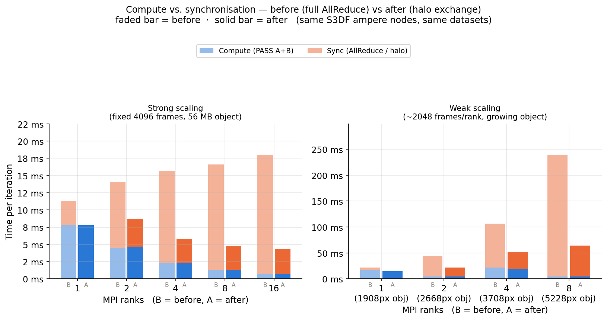
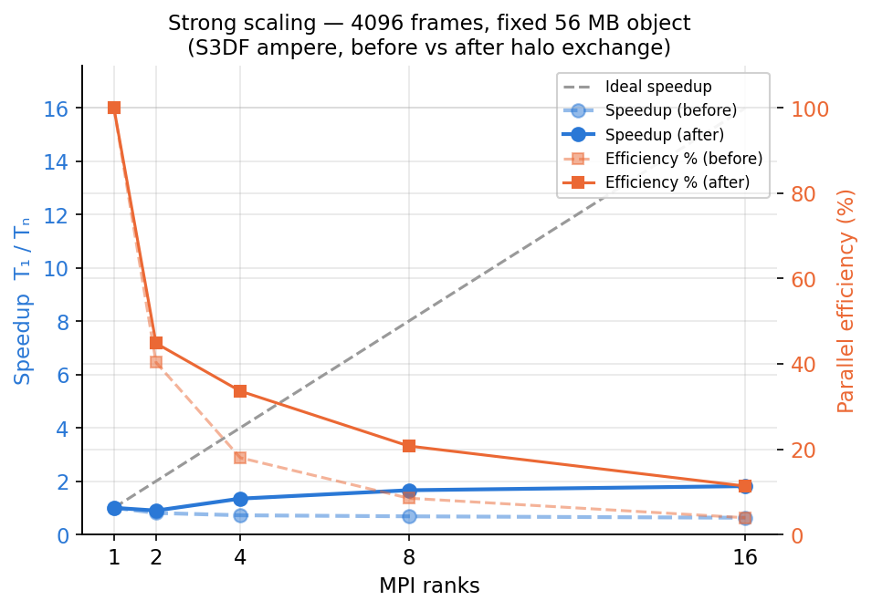
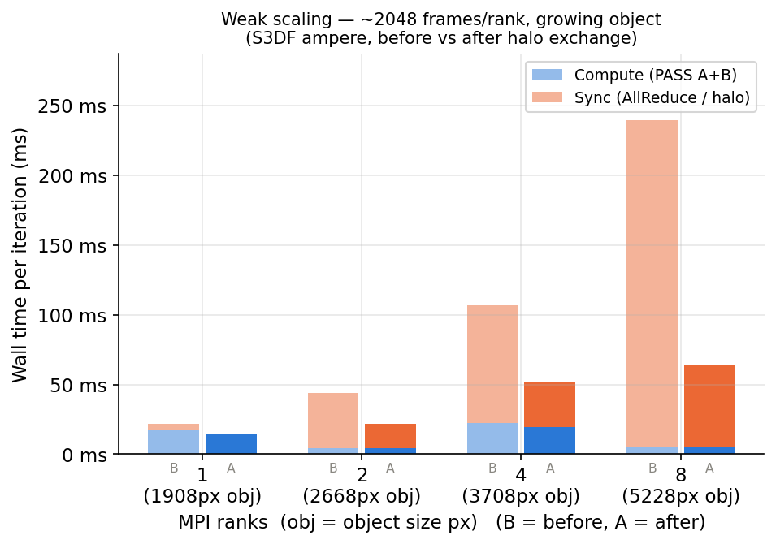

# Object-AllReduce → halo exchange — status report

Implements the fix described in `README_object_halo.md` (handoff 2026-07-21):
replacing PASS B's full-canvas `mpi_allSum` with `exchange_object_halo`'s
overlap-strip exchange. Both new files (`mpi_object_halo.py`,
`validate_object_halo.py`) are in `sharpy/`, wired into `mpi_AP_step` and
`mpi_AP_step_timed` (opt-in via `object_halo=None` default, so existing
callers are unaffected unless they explicitly pass one in — `benchmark_mpi_weak`/
`benchmark_mpi_strong` now do).

## Step 1 — the gate

Both required scales pass, with genuine multi-rank MPI (confirmed via a
`size=N` diagnostic, not the false-positive single-process runs hit along the
way — see "what broke" below):

```
srun -n 4   CORRECTNESS  object+norm match on every tile : True   max|err|=4.77e-07
srun -n 16  CORRECTNESS  object+norm match on every tile : True   max|err|=7.15e-07
```

Both errors sit at the float32 reduction-order noise floor the doc predicted
(~1e-6).

## A real bug found and fixed: periodic wraparound

`overlap.cu`/`split.cu` index with `% img_width` / `% img_height` — a frame
whose footprint would extend past the Ny/Nx edge wraps around and writes at
the *start* of that axis instead. The original bbox implementation just
clipped at the canvas edge instead of wrapping, silently dropping that
contribution. This only surfaced once real cross-rank MPI was working (see
below) — the 2-rank gate failed with `max|err|=4.72`, isolated entirely to
one rank's *non-shared* region (its own exclusive tile, which should need no
exchange at all).

Root cause: `poster_simulate.simulate()` sizes the canvas tightly
(`Nx = ceil(max(tx)-min(tx))`, no margin), so frames near the max translation
sit right at the boundary and wrap — plausible for any dataset without a
comfortable margin, not just this synthetic one.

Fix: `mpi_object_halo.py`'s `_footprint_rects` now splits a rank's footprint
into up to 4 disjoint rects (2 x-spans × 2 y-spans) when the aggregate
footprint wraps, and pairs every rect against every neighbour's rects.
Verified against a brute-force per-frame reference (with the same modulo
wraparound) in a standalone numpy check before re-testing on GPU — see
`sim_halo_wrap_check.py`. Re-ran both gates after the fix; both green.

## What broke along the way (S3DF-specific, not a sharpy bug)

Worth documenting since it'll bite the next person setting this up here:

1. **`sinfo`/`scontrol`/`srun` aren't on `sdflogin001`** — need to `ssh iana`
   first; that host has the real Slurm client (`/opt/slurm/slurm-curr/bin/`).
2. **`cupy-cuda12x`'s pip wheel has no bundled/system CUDA toolkit on this
   cluster** — `Operators.py`'s `cupyx.scipy.sparse.linalg.eigsh` import
   needs `libcublas.so.12` etc., which don't exist anywhere on the node.
   Fixed by `pip install nvidia-cublas-cu12 nvidia-cusparse-cu12
   nvidia-cusolver-cu12 nvidia-curand-cu12 nvidia-cufft-cu12
   nvidia-cuda-nvrtc-cu12 nvidia-cuda-runtime-cu12 nvidia-nvjitlink-cu12`
   and adding their `lib/` dirs to `LD_LIBRARY_PATH`.
3. **The `ampere` partition mixes OS versions** — 13/42 nodes are RHEL 9.6
   (glibc 2.34), the other 29 are RHEL 8.6 (glibc 2.28). Our OpenMPI build
   needs glibc ≥2.29, so unpinned jobs failed ~69% of the time. Fixed with
   `#SBATCH --constraint=OS_VER:9.6`.
4. **The biggest one — the sdfampere-specific OpenMPI build has no PMI/PMIx
   support at all.** Under direct `srun` launch, every rank silently
   initializes as its own singleton `SIZE=1` MPI job instead of joining a
   real communicator. This is *silent* — no crash, no error, `mpi_allSum`
   and `exchange_object_halo` both have `if SIZE==1: no-op` fallbacks, so
   the 4- and 16-rank gates printed `CORRECTNESS ... True` on their first
   runs with **zero actual cross-rank communication tested**. Caught it by
   noticing the result block printed once per rank instead of once total
   (only rank 0 should print) and confirming with a bare `rank/size` probe.
   Fixed by rebuilding `mpi4py` against `/sdf/sw/openmpi/v4.1.6/ompi/build`
   (has `MCA plm: slurm`, `ess: slurm`) and adding `srun --mpi=pmix`. This
   is the fix that made the wraparound bug above visible in the first place
   — everything before it was a false green.

## Scaling results — before vs after, same S3DF nodes

Re-measured the original `mpi_allSum` path (`SHARPY_NO_HALO=1` env-var
escape hatch, not a code path change) on identical `sdfampere` A100
allocations for a fair comparison — not the historical Perlmutter numbers.



**Strong scaling** (fixed 4096-frame dataset):

| ranks | sync/compute (before) | sync/compute (after) | total (before → after) |
|---|---|---|---|
| 1 | — | — | 11.3ms → 7.8ms |
| 2 | 2.1x | 0.9x | 14.1ms → 8.7ms |
| 4 | 5.8x | 1.5x | 15.7ms → 5.9ms |
| 8 | 11.8x | 2.6x | 16.6ms → 4.7ms |
| 16 | 24.7x | 5.1x | 18.0ms → 4.3ms |

16-rank sync/compute ratio drops **~5x** (24.7x → 5.1x on this run; the
original diagnosis on the prior cluster measured 115x, same qualitative
collapse). Net effect: 1→16 ranks goes from a **slowdown** (18.0ms → still
18ms-ish before, effectively flat/negative scaling) to a real **1.8x
speedup** (parallel efficiency ~11%, up from ~4% here / ~1.4% on the
original diagnosis).



**Weak scaling** (object grows 1908px → 5228px alongside rank count):

| ranks | total (before) | total (after) |
|---|---|---|
| 1 | 22.1ms | 14.6ms |
| 2 | 43.8ms | 21.7ms |
| 4 | 106.6ms | 52.1ms |
| 8 | 239.2ms | 64.5ms |

Growth factor 1→8 ranks: **10.8x → 4.4x** (down from the ~59x originally
reported on the prior cluster/dataset). Sync still grows with object size —
expected, the doc's own complexity is O(overlap·Ny), so a wider object means
a wider halo strip — but nowhere near the old O(Nx·Ny) blowup.



**One honest caveat**: compute time itself isn't flat across weak-scaling
ranks (22.2ms at 4 ranks vs 4.7ms at 8). Root-caused, not noise: PASS A's
`Project_data` calls `fft2` per frame batch (`frame_batch=1024` default),
and cuFFT's plan cache is shape-sensitive. `local_nframes=2025` (ranks 1, 4)
splits into batches of `[1024, 1001]` — two plan shapes; `local_nframes=2048`
(ranks 2, 8) splits into `[1024, 1024]` — one shape, reused. This is a
pre-existing PASS A artifact, unrelated to the halo-exchange change (nearly
identical compute numbers in both before/after columns above confirm it).
Separate, optional fix: pick `frame_batch` to evenly divide `local_nframes`.

## Not done (explicitly out of scope per the doc)

- GPU transport (NCCL / CUDA-aware MPI under the `Isend`/`Irecv` in
  `exchange_object_halo`) — tiling fixed the scaling; this would fix the
  constant on the now-small strips.
- The multigrid schedule study (cheap local AP steps vs. global Gramian
  syncs) — doc explicitly frames this as the next open question, worth doing
  now that both comms are O(halo).
- A stashed, more ambitious WIP (`git stash@{0}`, "tiled-object-and-weak-
  scaling-wip") tiles *both* PASS A and PASS B via a fixed-grid decomposition
  with 4-neighbour `Sendrecv` halo exchange — deliberately set aside to
  follow this doc's narrower, gated approach first. Left untouched; a
  natural candidate for the "tile PASS A too" extension once this lands.
